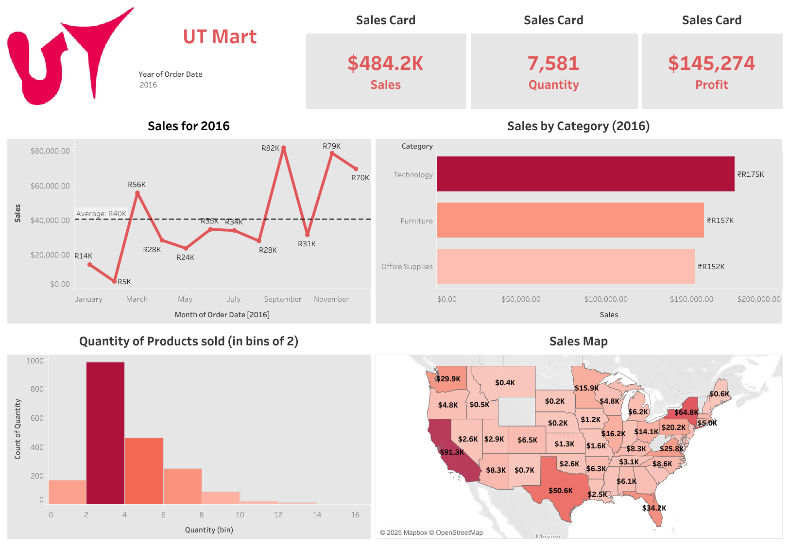

# 🛒 UT Mart Sales Dashboard

## 📌 Project Overview

UT Discount Mart is a small supermarket owned by **Mr. Utkarsh**.
The goal of this project is to analyze sales data and create an interactive dashboard to help track the store’s performance in terms of:

* **Sales**
* **Profit**
* **Quantity Sold**

Additionally, the dashboard provides insights into:

* Category-wise performance
* Regional performance
* Customer basket analysis (average number of products per order)

💡 Note: Profit is assumed to be **30% of the selling price**.

---

## 📂 Project Files

* `UT Mart csv file.csv` → Raw sales dataset
* `UT Mart Project Brief.txt` → Project requirements and objectives
* `UT mart.twbx` → Tableau packaged workbook (interactive dashboard)

---

## 📊 Dashboard Features

* Track **total sales, profit, and quantity**
* Visualize **category-wise trends**
* Compare **different regions**
* Analyze **customer basket size** (average products per order)
* Interactive filters for deeper insights

---

## 🛠️ Tools & Technologies

* **Tableau** → For dashboard creation
* **CSV Data (Excel / Spreadsheet)** → For raw dataset
* **Python / Pandas (Optional)** → For preprocessing (if needed)

---

## 🚀 How to Use

1. Download the repository.
2. Open the file `UT mart.twbx` in **Tableau Desktop / Tableau Public**.
3. Explore the interactive dashboard.

---

## 📷 Dashboard Preview

---

## 📈 Key Insights (Example)

* Top-performing categories and regions identified
* Average basket size confirmed to be **2+ items per order**
* Profitability trends align with expected **30% margin**

---

## 👤 Author

**Joyston Jose D’souza**
📧 \[joystondsouza450@gmail.com]
🔗 \[www.linkedin.com/in/joystondsouza09]
